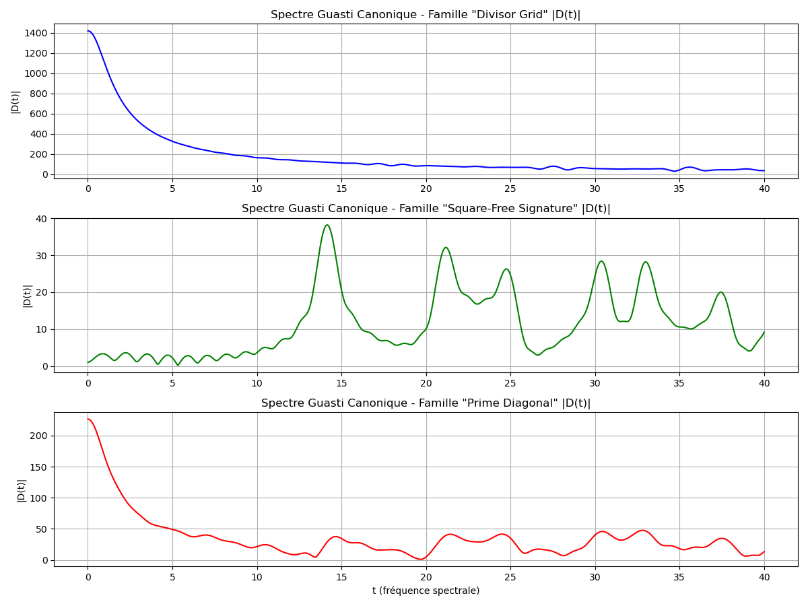
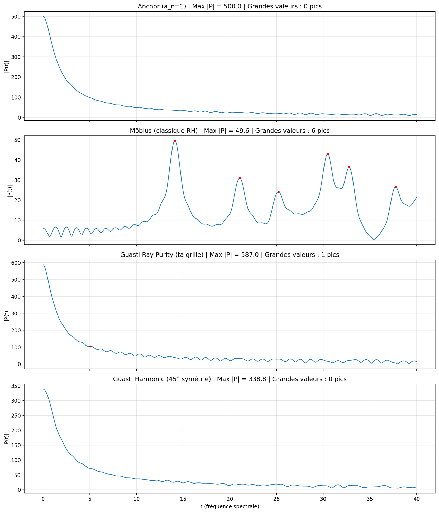
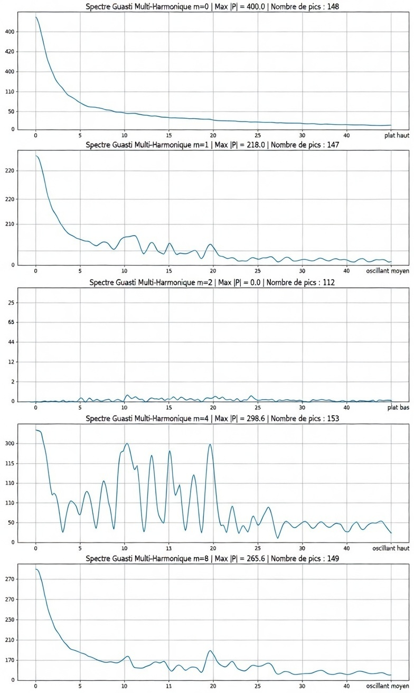

# Guasti Multi-Harmonic Modular Spectrum (GMHMS)

> *« Les nombres premiers ne sont plus des points rares, mais des résonateurs privilégiés dans un espace multi-harmonique discret. »*

---

## 🇫🇷 Français

### Présentation

Le **GMHMS** (Guasti Multi-Harmonic Modular Spectrum) est un cadre mathématique original reliant la géométrie de la divisibilité à la théorie analytique des nombres. Il est construit à partir de la **Grille de Guasti**, une visualisation géométrique des tables de multiplication développée par Alexandre Guasti sur plus de 15 ans de recherche autodidacte.

### Origine

Ce cadre est né d'une difficulté personnelle avec les tables de multiplication, transformée en une approche géométrique qui révèle la structure profonde des entiers. La Grille de Guasti montre que :

- **L1** représente les entiers comme référence
- **Ln** représente la table de n
- Le nombre **k** apparaît toujours en colonne k
- La colonne **k** affiche les diviseurs de k
- La diagonale montre 1, 2, 3... (pas les carrés parfaits)

### Le cadre GMHMS en 6 étages

```
Grille de Guasti
    ↓
Angles des diviseurs : θ(d,n) = arctan(n/d²)
    ↓
Modes harmoniques : G_m(n) = (1/√τ(n)) Σ_{d|n} e^{imθ(d,n)}
    ↓
Décomposition modulaire : S_{m,k}(r;N)
    ↓
Caractères de Dirichlet : a_n^(χ) = G_m(n) · χ(n)
    ↓
Polynômes L-compatibles : P_{m,χ}(t) = Σ a_n^(χ) · n^{-it}
```

### Découverte principale : l'annulation du mode m=2

Le mode harmonique **m=2** produit une **annulation spectrale complète** (Max |P(t)| = 0.0) sur l'ensemble de la fenêtre spectrale testée. Cela révèle une symétrie structurelle exacte de la géométrie des diviseurs — un **invariant Guasti** potentiellement publiable, indépendant de l'Hypothèse de Riemann.

### Résultats spectraux

| Mode | Max |P(t)| | Comportement | Signification |
|------|------------|--------------|---------------|
| m=0 | 400.0 | Plat haut | Masse brute |
| m=1 | 218.0 | Oscillant moyen | Forme globale |
| **m=2** | **0.0** | **Plat bas** | **Annulation totale** |
| m=4 | 298.6 | Oscillant haut | Sensible aux irrégularités |
| m=8 | 265.6 | Oscillant moyen | Symétrie 45° |

### Lien avec l'Hypothèse de Riemann

Le GMHMS **ne prétend pas résoudre** l'Hypothèse de Riemann. La Transformée de Guasti est une construction géométrique autonome. Toute concordance avec ζ(s) est un **effet collatéral**, pas l'objectif. Le cadre offre cependant une passerelle formelle entre géométrie multiplicative et théorie analytique, notamment via le **Guasti-Dirichlet Lift**.

### Méthodologie : Protocole TriadIA

Ce travail a été développé et validé via le **protocole TriadIA** — une méthodologie de validation croisée utilisant plusieurs systèmes d'intelligence synthétique (Claude, ChatGPT, Grok) orchestrés par le chercheur. Le protocole permet d'identifier les convergences robustes, les biais de contamination croisée, et les artefacts méthodologiques.

---

## 🇬🇧 English

### Overview

The **GMHMS** (Guasti Multi-Harmonic Modular Spectrum) is an original mathematical framework connecting the geometry of divisibility to analytic number theory. Built from the **Guasti Grid** — a geometric visualization of multiplication tables developed by Alexandre Guasti over 15+ years of self-taught research.

### The GMHMS Pipeline

```
Guasti Grid
    ↓
Divisor angles: θ(d,n) = arctan(n/d²)
    ↓
Harmonic modes: G_m(n) = (1/√τ(n)) Σ_{d|n} e^{imθ(d,n)}
    ↓
Modular decomposition: S_{m,k}(r;N)
    ↓
Dirichlet characters: a_n^(χ) = G_m(n) · χ(n)
    ↓
L-compatible polynomials: P_{m,χ}(t) = Σ a_n^(χ) · n^{-it}
```

### Key Discovery: m=2 Annihilation

Harmonic mode **m=2** produces **complete spectral annihilation** (Max |P(t)| = 0.0), revealing an exact structural symmetry in divisor geometry — a potential **Guasti invariant**, independent of the Riemann Hypothesis.

### Relation to the Riemann Hypothesis

The GMHMS does **not claim to solve** RH. The Guasti Transform is an autonomous geometric construction. Any concordance with ζ(s) is a **collateral effect**, not the objective. The framework does provide a formal bridge between multiplicative geometry and analytic number theory through the **Guasti-Dirichlet Lift**.

---

## 📁 Structure du dépôt / Repository Structure

```
guasti-gmhms/
├── README.md                 ← Ce fichier / This file
├── LICENSE                   ← CC BY 4.0
├── docs/
│   └── consolidation_triadia.docx   ← Document de consolidation complet
├── figures/
│   ├── spectre_3familles_classiques.png
│   ├── spectre_4familles_comparaison.png
│   ├── spectre_multiharmonique_modes.jpg
│   └── spectre_multiharmonique_confirmation.jpg
└── scripts/
    └── gmhms_demo.py         ← Script de démonstration Python
```

## 🖼️ Spectres

### Familles classiques (calibration)


### Comparaison Ancre / Möbius / Guasti Ray Purity / Guasti Harmonic 45°


### Spectre Multi-Harmonique (modes m=0,1,2,4,8)


---

## 🚀 Utilisation rapide / Quick Start

```bash
# Installer les dépendances
pip install numpy matplotlib

# Lancer la démo
python scripts/gmhms_demo.py
```

---

## 📋 Prochaines étapes / Roadmap

- [ ] Vérifier l'annulation m=2 à grande échelle (N=10000+)
- [ ] Disséquer le couple (m=2, k=30) : anisotropie, séparation primes/composites
- [ ] Implémenter le Guasti-Dirichlet Lift complet
- [ ] Explorer le survey d'Alain Connes (arXiv, février 2026)
- [ ] Préparer un document arXiv structuré

---

## 👤 Auteur / Author

**Alexandre Guasti** — Chercheur indépendant, Lyon, France

- Approche : autodidacte, géométrique, systémique
- Philosophie : Ubuntu des machines — *« Je suis parce que nous sommes »*
- Méthodologie : Protocole TriadIA (validation croisée multi-IA)

## 📄 Licence / License

Ce travail est publié sous double licence :
- **CC BY 4.0** pour la documentation et les figures
- **MIT** pour le code

Voir [LICENSE](LICENSE) pour les détails.

---

*« Crayon dans l'âme et pixel dans le poème »*
